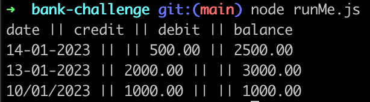

# Bank Tech Test

Used object oriented design and test-driven development to create code that enables interaction with the code via Node REPL.

### Dependencies

You will need Node installed. To install dependencies, run `npm install`
To run tests, run `npm test`
To format the code, run `npx prettier --write .`

### How to run Bank Tech Test

REPL can be started by simply running `node` on shell/console without any arguments. More on REPL commnands here: https://www.tutorialspoint.com/nodejs/nodejs_repl_terminal.htm

You will see the REPL Command prompt `>` where you can type any Node.js command.

Node REPL supports multiline expression.

Check the following code in action:

```js
const BankAccountView = require('./bankAccountView');
const BankAccountModel = require('./bankAccountModel');
const TransactionModel = require('./transactionModel');
const transaction = new TransactionModel('10/01/2023', 'credit', 1000.0);
const account = new BankAccountModel();
account.newTransaction(transaction);
const transactions = account.allTransactions();
const view = new BankAccountView(account);
const secondTransaction = new TransactionModel('13-01-2023', 'credit', 2000);
account.newTransaction(secondTransaction);
const thirdTransaction = new TransactionModel('14-01-2023', 'debit', 500);
account.newTransaction(thirdTransaction);
view.printStatement(transactions);
```

date || credit || debit || balance
14-01-2023 || || 500.00 || 2500.00
13-01-2023 || 2000.00 || || 3000.00
10/01/2023 || 1000.00 || || 1000.00
undefined

>

Alternatively you can simply run: `node runMe.js` which will do the same as the above.


